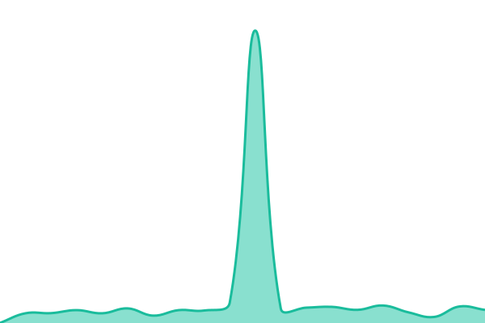

# [📈 Live Status](https://bcgov.github.io/hous-permit-uptime): <!--live status--> **🟩 All systems operational**

This repository contains the open-source uptime monitor and status page for [bcgov](https://github.com/bcgov/BC-Policy-Framework-For-GitHub), powered by [Upptime](https://github.com/upptime/upptime).

With [Upptime](https://upptime.js.org), you can get your own unlimited and free uptime monitor and status page, powered entirely by a GitHub repository. We use [Issues](https://github.com/bcgov/hous-permit-uptime/issues) as incident reports, [Actions](https://github.com/bcgov/hous-permit-uptime/actions) as uptime monitors, and [Pages](https://bcgov.github.io/hous-permit-uptime) for the status page.

<!--start: status pages-->
<!-- This summary is generated by Upptime (https://github.com/upptime/upptime) -->
<!-- Do not edit this manually, your changes will be overwritten -->
<!-- prettier-ignore -->
| URL | Status | History | Response Time | Uptime |
| --- | ------ | ------- | ------------- | ------ |
|  [Building Permit Hub](https://buildingpermit.gov.bc.ca) | 🟩 Up | [building-permit-hub.yml](https://github.com/bcgov/hous-permit-uptime/commits/HEAD/history/building-permit-hub.yml) | 

 400ms
     
 | 

<a href="https://bcgov.github.io/hous-permit-uptime/history/building-permit-hub">89.18%</a>
    

|  [External Dependencies: Authentication Service](https://status.loginproxy.gov.bc.ca/) | 🟩 Up | [external-dependencies-authentication-service.yml](https://github.com/bcgov/hous-permit-uptime/commits/HEAD/history/external-dependencies-authentication-service.yml) | 

 380ms
     
 | 

<a href="https://bcgov.github.io/hous-permit-uptime/history/external-dependencies-authentication-service">100.00%</a>
    

|  [External Dependencies: BC Address Geocoder](https://geocoder.api.gov.bc.ca/sites) | 🟩 Up | [external-dependencies-bc-address-geocoder.yml](https://github.com/bcgov/hous-permit-uptime/commits/HEAD/history/external-dependencies-bc-address-geocoder.yml) | 

 552ms
     
 | 

<a href="https://bcgov.github.io/hous-permit-uptime/history/external-dependencies-bc-address-geocoder">93.94%</a>
    

|  [External Dependencies: LTSA ParcelMap BC](https://maps.gov.bc.ca/arcserver/rest/) | 🟩 Up | [external-dependencies-ltsa-parcel-map-bc.yml](https://github.com/bcgov/hous-permit-uptime/commits/HEAD/history/external-dependencies-ltsa-parcel-map-bc.yml) | 

 264ms
     
 | 

<a href="https://bcgov.github.io/hous-permit-uptime/history/external-dependencies-ltsa-parcel-map-bc">96.24%</a>
    

|  [External Dependencies: BC Admin Boundaries](https://delivery.maps.gov.bc.ca/arcgis/rest/) | 🟩 Up | [external-dependencies-bc-admin-boundaries.yml](https://github.com/bcgov/hous-permit-uptime/commits/HEAD/history/external-dependencies-bc-admin-boundaries.yml) | 

 269ms
     
 | 

<a href="https://bcgov.github.io/hous-permit-uptime/history/external-dependencies-bc-admin-boundaries">96.72%</a>
    

|  [External Dependencies: EPSG Registry](https://epsg.io/4326.json) | 🟩 Up | [external-dependencies-epsg-registry.yml](https://github.com/bcgov/hous-permit-uptime/commits/HEAD/history/external-dependencies-epsg-registry.yml) | 

 255ms
     
 | 

<a href="https://bcgov.github.io/hous-permit-uptime/history/external-dependencies-epsg-registry">100.00%</a>
    

|  [External Service: Archistar Platform (Canada)](https://status.archistar.ai/api/v2/components/nltw0ymw9qx0.json) | 🟩 Up | [external-service-archistar-platform-canada.yml](https://github.com/bcgov/hous-permit-uptime/commits/HEAD/history/external-service-archistar-platform-canada.yml) | 

 242ms
     
 | 

<a href="https://bcgov.github.io/hous-permit-uptime/history/external-service-archistar-platform-canada">100.00%</a>
    

|  [External Dependencies: Keycloak Authentication](https://status.loginproxy.gov.bc.ca/statuspage/sso-keycloak-uptime/5830615) | 🟩 Up | [external-dependencies-keycloak-authentication.yml](https://github.com/bcgov/hous-permit-uptime/commits/HEAD/history/external-dependencies-keycloak-authentication.yml) | 

 455ms
     
 | 

<a href="https://bcgov.github.io/hous-permit-uptime/history/external-dependencies-keycloak-authentication">100.00%</a>
    

<!--end: status pages-->

[**Visit our status website →**](https://bcgov.github.io/hous-permit-uptime)

## 📄 License

- Powered by: [Upptime](https://github.com/upptime/upptime)
- Code: [MIT](./LICENSE) © [Anand Chowdhary](https://anandchowdhary.com), supported by [Pabio](https://pabio.com)
- Data in the `./history` directory: [Open Database License](https://opendatacommons.org/licenses/odbl/1-0/)
